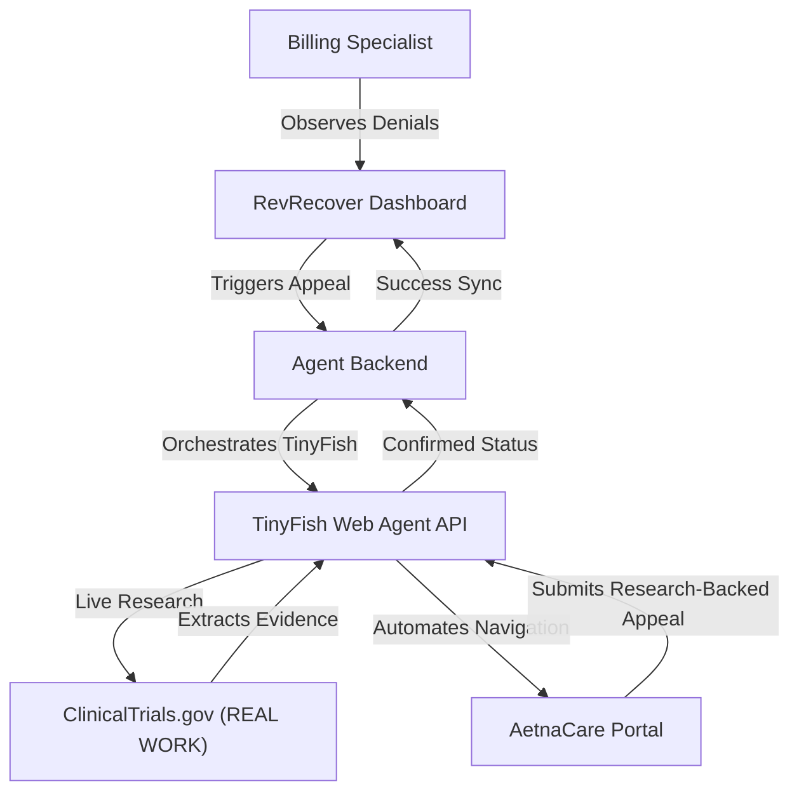

# RevRecover: Medical Claims Denial Appeal Agent

**RevRecover** is a "God Tier" automation suite designed for the TinyFish Hackathon. It solves the multi-billion dollar problem of medical insurance claim denials by utilizing the **TinyFish Agentic Web Framework** to automate the appeals process.

## 🚀 The Problem
Medical billing specialists spend hours manually logging into insurance portals to fight denied claims. **RevRecover** replaces this manual labor with a "Robot Staffing Agency" that logs in, analyzes the denial, and submits a professional appeal letter in seconds.

## 🛡️ Architecture
The suite consists of three core components:

1.  **[RevRecover App](./app):** A premium React/Vite command center where specialists manage denials and trigger agents.
2.  **[Agent Backend](./backend):** The orchestration layer that connects the dashboard to the TinyFish Web Agent API.
3.  **[Enterprise Portal](./enterprise-portal):** A high-fidelity insurance portal simulation built to prove the agent's ability to handle complex, messy web UIs.



## 🛠️ Getting Started

### 1. Clone the repository
```bash
git clone https://github.com/your-username/revrecover.git
cd revrecover
```

### 2. Configure the Backend
Move to the `backend` directory, install dependencies, and set up your TinyFish API key.
```bash
cd backend
npm install
cp .env.example .env
# Edit .env and add your TINYFISH_API_KEY
npm start
```

### 3. Start the Enterprise Portal
The agent needs a target to act upon! Start the Payer simulation.
```bash
cd ../enterprise-portal
npm install
npm run dev
```

### 4. Launch the RevRecover App
Finally, start the RevRecover command center.
```bash
cd ../app
npm install
npm run dev
```

## ☁️ Deployment: AWS Amplify (Recommended)

To satisfy the hackathon requirement of **"Real Work on the Web"**, you are hosting the suite on AWS Amplify. This allows the TinyFish Cloud Agent to access your Mock Portal over the public internet.

### 1. Monorepo Setup (Amplify Hosting)
Connect your GitHub repository to **AWS Amplify Hosting**. 
- Amplify will detect the root `amplify.yml` and automatically deploy both the **Dashboard** and the **Mock Portal** as separate sub-apps.

### 2. Environment Variables & Secrets
For the agent to function in the cloud, you must configure **Environment Variables** in the Amplify Console:

| Component | Variable Name | Description |
| :--- | :--- | :--- |
| **Backend** | `TINYFISH_API_KEY` | Your secret API key. Configure this in Amplify Secrets or App Runner. |
| **Backend** | `MOCK_PORTAL_URL` | The public URL of your **Enterprise Portal** (provided by Amplify). |
| **App** | `VITE_API_URL` | The public URL of your **Backend API**. |

### 3. "Real Work" Verification
Once deployed:
1.  Open your **RevRecover App** (Amplify URL).
2.  Paste your **Enterprise Portal URL** (Amplify URL) into the "Live Agent Mode" box.
3.  Trigger the agent. It will autonomously navigate the public internet to [ClinicalTrials.gov](https://clinicaltrials.gov/) for research, and then login to your production-hosted **Enterprise Portal** to verify the claim.

## 🔒 Security First: Protecting your Secrets

To ensure your TinyFish API key is never exposed to the public:

1.  **Backend Only:** The TinyFish API key is **only** used in the `backend/` folder. It is never sent to or used by the `dashboard/` (frontend).
2.  **Environment Variables:** I have pre-configured `.gitignore` files in the root and all subdirectories to prevent `.env` files from ever being pushed to GitHub.
3.  **Amplify Secrets:** When deploying to AWS Amplify, **do not** hardcode the key. Use the [Amplify Secrets Management](https://docs.aws.amazon.com/amplify/latest/userguide/environment-variables.html#secrets) or Environment Variables console.
4.  **Backend Logging:** The backend logs are configured to notify you if the key is missing, but they will **never** print the actual key to the console or the feed.

Before pushing to GitHub, run this command to be 100% sure no keys are present:
```bash
grep -r "TF_" .
```
*(If it returns only results in your local `.env` and `.env.example`, you are safe!)*

## 💡 Why TinyFish?
RevRecover utilizes the unique power of the **TinyFish Agentic Framework** to solve challenges that traditional automation (like Selenium or Puppeteer) can't touch:
-   **Dynamic Research (Real Work):** The agent doesn't just click buttons; it visits live medical databases to find a "reason" to win the appeal.
-   **DOM Resilience:** Using natural language goals, the agent can navigate messy insurance portals even if the HTML structure changes.
-   **Zero-Human Logic:** It handles complex, multi-modal workflows (HIPAA popups, auth dialogs) autonomously without hardcoded scripts.

## 🏆 Hackathon Features
-   **"God Tier" Aesthetic:** Platinum Enterprise UI with glassmorphism and depth effects.
-   **Live Agent Terminal Feed:** Real-time visibility into the AI's research and actions.
-   **Business Value Analytics:** Instant tracking of recovered revenue and human hours saved.
-   **Clinical Research Integration:** Demonstrates real, autonomous work on the live web.

---
Built with ❤️ for the **TinyFish Hackathon**.
